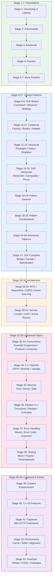

# C++ Learning Path

```mermaid
graph TD
    subgraph Foundations ["Stage 1-7: Foundations"]
        S1[Stage 1: Ownership & Lifetime]
        S2[Stage 2: Intermediate]
        S3[Stage 3: Advanced]
        S4[Stage 4: Practice]
        S5[Stage 5-7: More Practice]
    end

    subgraph Patterns ["Stage 8-27: Design Patterns"]
        S8[Stage 8-9: GoF Basics<br>Command / Observer / Strategy]
        S10[Stage 10-11: Creational<br>Factory / Builder / Adapter]
        S12[Stage 12-13: Structural<br>Flyweight / Visitor / Singleton]
        S14[Stage 14-15: GoF Advanced<br>Interpreter / Composite / Proxy]
        S16[Stage 16-19: Pattern Variants]
        S20[Stage 20-23: Pattern Combinations]
        S24[Stage 24-26: Advanced Patterns]
        S27[Stage 27: GoF Complete<br>Bridge / Facade / Specification]
    end

    subgraph Architecture ["Stage 28-31: Architecture"]
        S28[Stage 28-29: MVC / Repository / CQRS / Event Sourcing]
        S30[Stage 30-31: Service Locator / UoW / Active Record]
    end

    subgraph Advanced ["Stage 32-38: Advanced Topics"]
        S32[Stage 32-33: Concurrency<br>Guarded Suspension / Producer-Consumer]
        S34[Stage 34: C++ Specific<br>CRTP / SFINAE / Variadic]
        S35[Stage 35: Memory<br>Pool / Arena / Slab]
        S36[Stage 36: Modern C++<br>Coroutines / Ranges / Concepts]
        S37[Stage 37: Error Handling<br>Result / Error Code / Expected]
        S38[Stage 38: Testing<br>Mock / Fixture / Parameterized]
    end

    subgraph Capstone ["Stage 39-43: Capstone & Extras"]
        S39[Stage 39: Content Enhancement]
        S40[Stage 40: C++23 Features]
        S41[Stage 41: Capstone<br>Mini HTTP Framework]
        S42[Stage 42: Performance<br>Cache / SIMD / Alignment]
        S43[Stage 43: Toolchain<br>CMake / CI/CD / Packages]
    end

    S1 --> S2 --> S3 --> S4 --> S5
    S5 --> S8
    S8 --> S10 --> S12 --> S14 --> S16 --> S20 --> S24 --> S27
    S27 --> S28 --> S30
    S30 --> S32 --> S34 --> S35 --> S36 --> S37 --> S38
    S38 --> S39 --> S40 --> S41 --> S42 --> S43

    style Foundations fill:#e8f5e9,stroke:#2e7d32
    style Patterns fill:#e3f2fd,stroke:#1565c0
    style Architecture fill:#fff3e0,stroke:#ef6c00
    style Advanced fill:#fce4ec,stroke:#c62828
    style Capstone fill:#f3e5f5,stroke:#6a1b9a
```

**Quick Path:** Stages 1→8→28→32→41 (minimal viable learning)
**Complete Path:** All 43 stages in order
