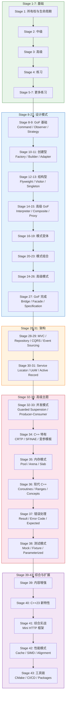

# C++ 学习路径图

```mermaid
graph TD
    subgraph 基础 ["Stage 1-7: 基础"]
        S1[Stage 1: 所有权与生命周期]
        S2[Stage 2: 中级]
        S3[Stage 3: 高级]
        S4[Stage 4: 练习]
        S5[Stage 5-7: 更多练习]
    end

    subgraph 模式 ["Stage 8-27: 设计模式"]
        S8[Stage 8-9: GoF 基础<br>Command / Observer / Strategy]
        S10[Stage 10-11: 创建型<br>Factory / Builder / Adapter]
        S12[Stage 12-13: 结构型<br>Flyweight / Visitor / Singleton]
        S14[Stage 14-15: 高级 GoF<br>Interpreter / Composite / Proxy]
        S16[Stage 16-19: 模式变体]
        S20[Stage 20-23: 模式组合]
        S24[Stage 24-26: 高级模式]
        S27[Stage 27: GoF 完成<br>Bridge / Facade / Specification]
    end

    subgraph 架构 ["Stage 28-31: 架构"]
        S28[Stage 28-29: MVC / Repository / CQRS / Event Sourcing]
        S30[Stage 30-31: Service Locator / UoW / Active Record]
    end

    subgraph 高级 ["Stage 32-38: 高级主题"]
        S32[Stage 32-33: 并发模式<br>Guarded Suspension / Producer-Consumer]
        S34[Stage 34: C++ 特有<br>CRTP / SFINAE / 变参模板]
        S35[Stage 35: 内存模式<br>Pool / Arena / Slab]
        S36[Stage 36: 现代 C++<br>Coroutines / Ranges / Concepts]
        S37[Stage 37: 错误处理<br>Result / Error Code / Expected]
        S38[Stage 38: 测试模式<br>Mock / Fixture / Parameterized]
    end

    subgraph 综合 ["Stage 39-43: 综合与扩展"]
        S39[Stage 39: 内容增强]
        S40[Stage 40: C++23 新特性]
        S41[Stage 41: 综合实战<br>Mini HTTP 框架]
        S42[Stage 42: 性能模式<br>Cache / SIMD / Alignment]
        S43[Stage 43: 工具链<br>CMake / CI/CD / Packages]
    end

    S1 --> S2 --> S3 --> S4 --> S5
    S5 --> S8
    S8 --> S10 --> S12 --> S14 --> S16 --> S20 --> S24 --> S27
    S27 --> S28 --> S30
    S30 --> S32 --> S34 --> S35 --> S36 --> S37 --> S38
    S38 --> S39 --> S40 --> S41 --> S42 --> S43

    style 基础 fill:#e8f5e9,stroke:#2e7d32
    style 模式 fill:#e3f2fd,stroke:#1565c0
    style 架构 fill:#fff3e0,stroke:#ef6c00
    style 高级 fill:#fce4ec,stroke:#c62828
    style 综合 fill:#f3e5f5,stroke:#6a1b9a
```

**快速路径：** Stage 1→8→28→32→41（最小可行学习）
**完整路径：** 按顺序完成全部 43 个阶段
